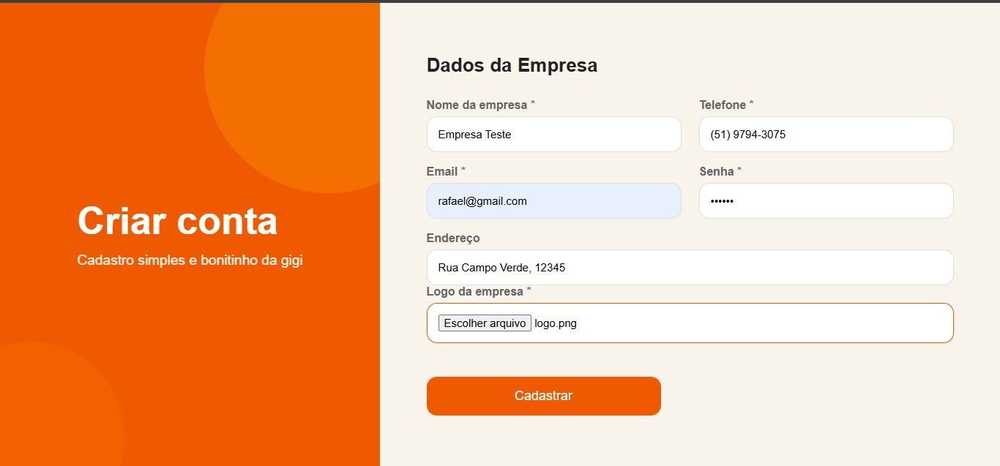
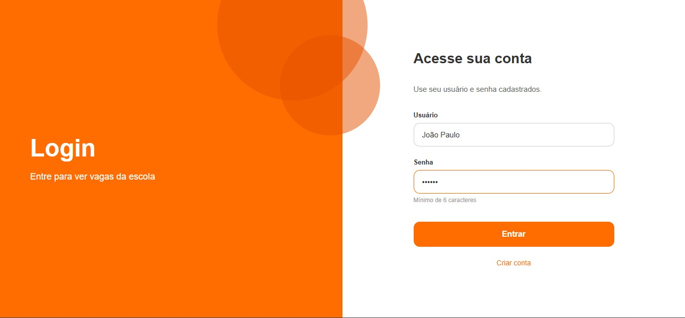
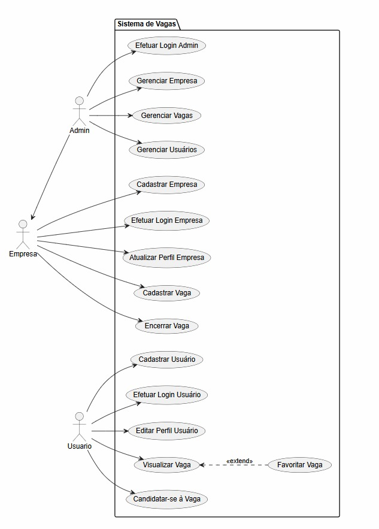
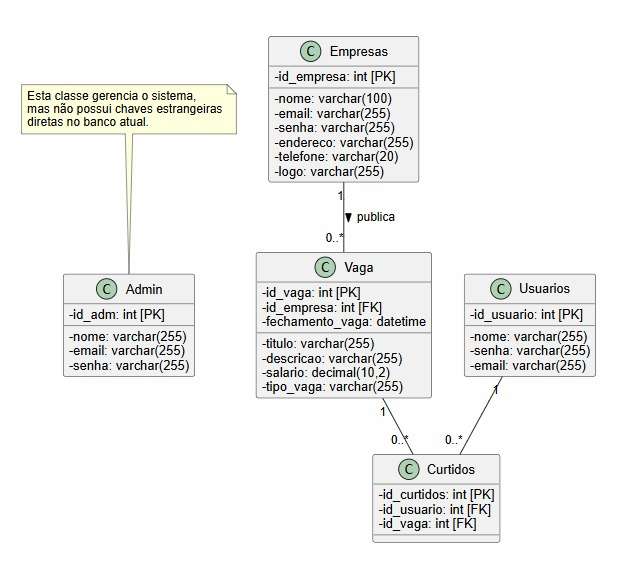

# Estagiou

Sistema web e mobile para publicação e gerenciamento de vagas de emprego, estágio e outras oportunidades, com painel administrativo, API pública e integração com empresas parceiras.

## Sobre o Projeto

O Mural de Oportunidades permite que empresas parceiras cadastrem vagas (estágio, CLT, jovem aprendiz, freelancer, entre outros) que ficam disponíveis para consulta via web e aplicativo mobile. Administradores possuem acesso total ao sistema, podendo gerenciar empresas, vagas, usuários e parceiros.

## Funcionalidades

<<<<<<< HEAD
- Cadastrar Usuários
- Efetuar Login
- Editar Perfil
- Visualização de Vaga
- Candidatar-se a Vaga
- Favoritar Vaga

### Administração
- Administrador geral com acesso total ao sistema.
- Visualização de dados das empresas: nome, contato do RH, e-mail, telefone, endereço, cnpj.
=======
### Administração
- Administrador geral com acesso total ao sistema.
- Visualização de dados das empresas: nome, contato do RH, e-mail, telefone, endereço.
>>>>>>> 827772f1d5bb62c46139d0e84465506ad2ac1b0b
- Visualização de todas as vagas, usuários e parceiros.

### Cadastro de Empresas
- Impede cadastro de empresas com nome duplicado.
<<<<<<< HEAD
- Dados obrigatórios: nome, e-mail, telefone, endereço, contato do RH e logo.
=======
- Campos obrigatórios: nome, e-mail, telefone, endereço, contato do RH e logo.
>>>>>>> 827772f1d5bb62c46139d0e84465506ad2ac1b0b
- Upload de imagem obrigatório, armazenada em coluna específica no banco de dados.

### Cadastro de Vagas
- Campos obrigatórios: título, descrição, salário/bolsa, empresa vinculada, tipo de contratação, cidade, data de publicação, data limite de inscrição e logo/banner da empresa.

### Regras de Negócio
- Vagas só podem ser excluídas após a data limite de inscrição.
- Sistema deve possuir no mínimo 5 empresas parceiras cadastradas.
- Usuários podem favoritar vagas (favoritos registrados no banco de dados).
- Filtro de busca por título da vaga.

### Dashboard Administrativo
- Total de vagas.
- Total de empresas.
- Total de tipos de contratação.
- Últimas 5 vagas cadastradas.

### API
- Endpoint JSON com todas as vagas ativas.
- Retorno inclui: empresa, cargo, descrição, salário, cidade, contato, data limite de inscrição e logo/banner.

### Aplicativo Mobile
**Feed de vagas:** logo da empresa, nome da empresa, cargo e tipo da vaga.

**Tela de detalhes:** empresa, cargo, descrição, salário, cidade, contato e data limite de inscrição.

### Autenticação
- Login por usuário e senha.
- Senha mínima de 6 caracteres.
- Senhas criptografadas com `password_hash()`.
- Controle de sessão seguro.

### Interface
- Layout responsivo para desktop e mobile.
- Logos e banners ajustados sem distorções.

<<<<<<< HEAD

## Interface Visual

## Estrutura de Diagrama

## Estrutura de Dados

O banco de dados  contempla as seguintes entidades:
=======
## Estrutura de Dados

O banco de dados deve contemplar as seguintes entidades:
>>>>>>> 827772f1d5bb62c46139d0e84465506ad2ac1b0b
- Usuários
- Empresas
- Vagas
- Favoritos
- Parceiros

<<<<<<< HEAD
  
## Como Executar

Clone o repositório:
git clone https://github.com/NicolasFernandes09/Estagiou.git

Configure o banco de dados:
Crie o banco no MySQL.

Importe o arquivo banco.sql.

Atualize as credenciais no arquivo config.php.

## Execução
Web

Inicie o Apache e o MySQL (XAMPP) e acesse:

http://localhost/index.php

## Tecnologias utilizadas Web

- **PHP** — estrutura semântica das páginas
- **CSS** — estilos e responsividade

## Observações

Este repositório contém apenas a versão alpha do projeto, projeto está em desenvolvimento.
=======
## Roteiro de Implementação

- [ ] Criar banco de dados completo (usuários, empresas, vagas, favoritos e parceiros).
- [ ] Implementar autenticação segura com login e senha criptografada.
- [ ] Desenvolver painel administrativo.
- [ ] Criar CRUD de empresas.
- [ ] Criar CRUD de vagas.
- [ ] Implementar upload e armazenamento de imagens.
- [ ] Criar dashboard com métricas e últimas vagas.
- [ ] Desenvolver API JSON das vagas.
- [ ] Criar sistema de favoritos.
- [ ] Implementar filtros de busca por título.
- [ ] Aplicar regras de negócio (empresa única e exclusão de vaga após prazo).
- [ ] Desenvolver aplicativo Android consumindo a API.
- [ ] Criar telas de feed e detalhes das vagas.
- [ ] Garantir responsividade e boa apresentação das imagens.
- [ ] Cadastrar e gerenciar empresas parceiras.

## Tecnologias

> *Preencher com as tecnologias utilizadas no projeto (ex.: linguagem de back-end, framework, banco de dados, framework mobile, etc.).*

## Como Executar

> *Preencher com instruções de instalação, configuração do banco de dados e execução do projeto (web e mobile).*

## Licença

> *Preencher com a licença do projeto, se aplicável.*
>>>>>>> 827772f1d5bb62c46139d0e84465506ad2ac1b0b
