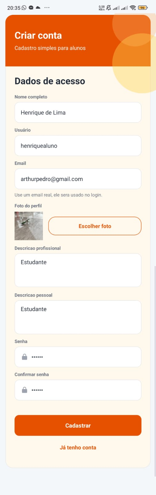
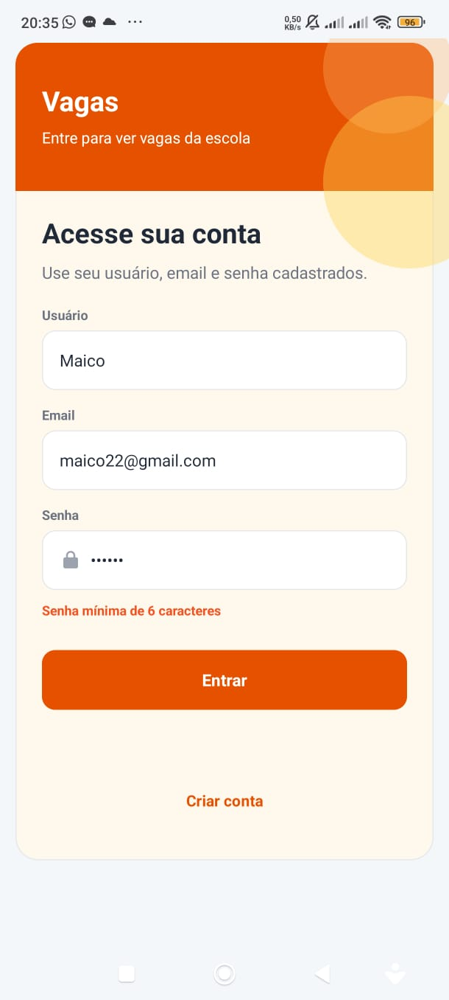
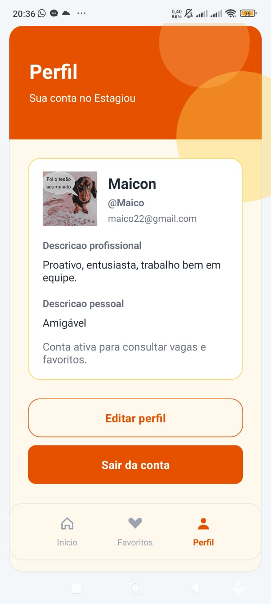
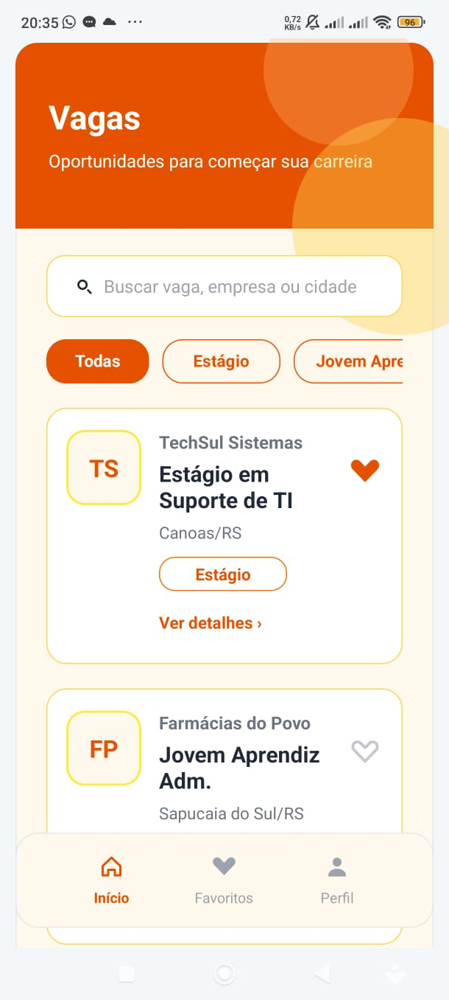
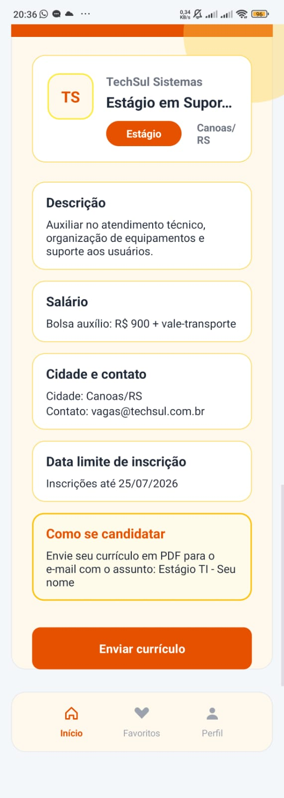
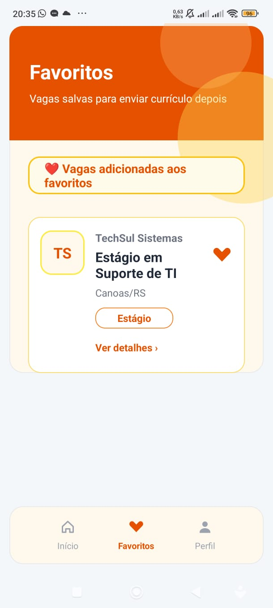

# Estagiou

Aplicativo Android para consulta de vagas de estágio, jovem aprendiz, freelancer e CLT, com cadastro de usuários, login, perfil, favoritos, filtros de busca e envio de currículo por e-mail.

## Sobre o Projeto

O Estagiou é um aplicativo mobile desenvolvido em Java no Android Studio. A proposta do app é facilitar a visualização de oportunidades profissionais, permitindo que o usuário encontre vagas, filtre por tipo de contratação, salve oportunidades favoritas e consulte os detalhes de cada vaga.

Nesta versão, o projeto está focado na experiência mobile do usuário, com telas de login, cadastro, listagem de vagas, detalhes da vaga, favoritos e perfil.

## Funcionalidades

- Cadastro de usuários.
- Login com usuário e senha.
- Senha mínima de 6 caracteres.
- Cadastro de foto de perfil.
- Cadastro de descrição profissional e descrição pessoal.
- Edição de perfil.
- Confirmação antes de sair da conta.
- Listagem de vagas disponíveis.
- Busca por vaga, empresa ou cidade.
- Filtros por tipo de vaga: Todas, Estágio, Jovem Aprendiz, Freelancer e CLT.
- Visualização dos detalhes da vaga.
- Favoritar e desfavoritar vagas.
- Página de favoritos atualizada conforme as vagas salvas.
- Menu inferior com indicação visual da tela atual.
- Assistente inicial para orientar o usuário na primeira utilização.
- Envio de currículo em PDF abrindo o aplicativo de e-mail do celular.

## Telas do Aplicativo

### Login
Tela inicial do aplicativo, onde o usuário insere e-mail (ou nome de usuário) e senha para acessar o sistema.

### Cadastro
Tela de criação de conta, onde o usuário informa nome completo, nome de usuário, e-mail, senha, confirmação de senha, foto de perfil e uma breve descrição sobre si.

### Vagas
Tela principal do aplicativo, com campo de busca, filtros por tipo de contratação e cards de vagas que dão acesso aos detalhes de cada oportunidade.

### Detalhes da Vaga
Tela com as informações completas da oportunidade, incluindo empresa, cargo, descrição, salário, cidade, contato, data limite de inscrição e instruções para envio do currículo.

### Favoritos
Tela que exibe as vagas marcadas com o ícone de coração. Ao desfavoritar uma vaga, ela deixa de aparecer na lista de favoritos.

### Perfil
Tela com dados do usuário logado, foto de perfil, e-mail, descrição profissional, descrição pessoal, botão para editar informações e opção para sair da conta.

## Tecnologias Utilizadas

- Java
- Android Studio
- XML
- SQLite
- SharedPreferences
- Volley
- BCrypt
- Gradle com Groovy DSL

## Configuração do Projeto

- Linguagem: Java
- Minimum SDK: API 27, Android 8.1
- Target SDK: 36
- Package/Application ID: `br.ulbra.estagiou`
